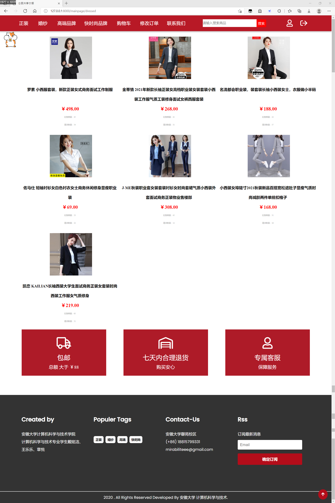
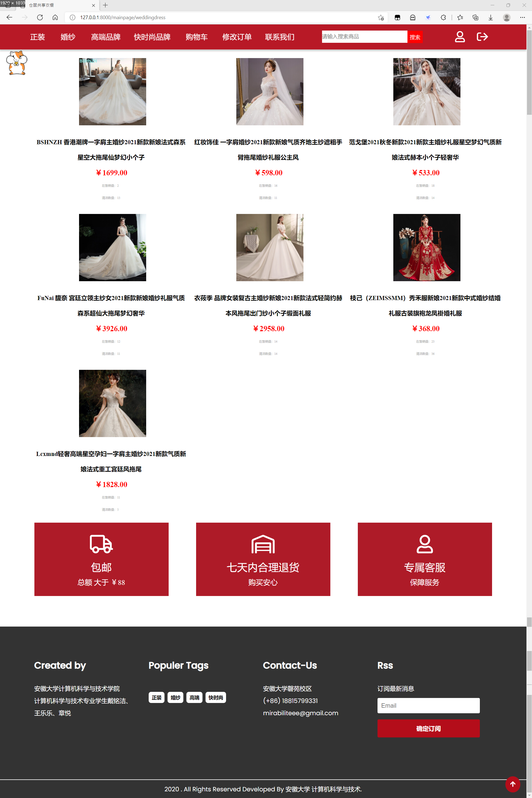
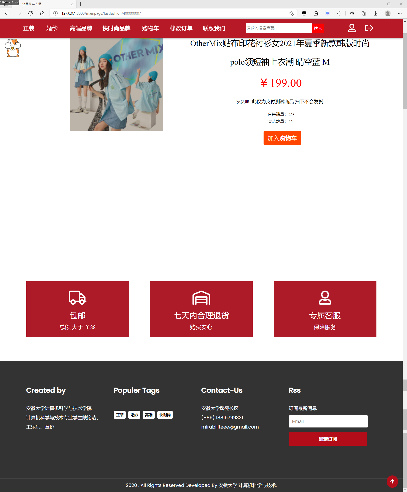
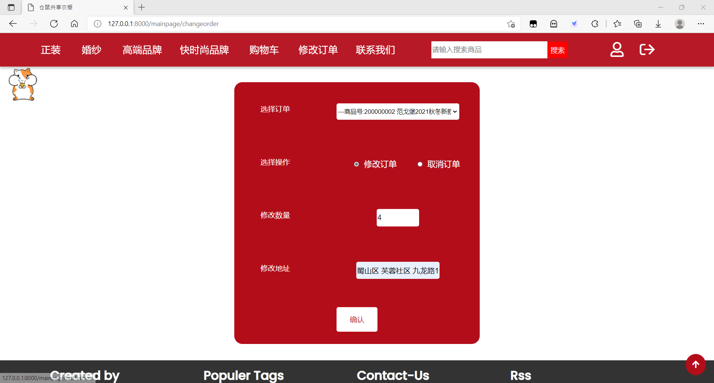

# 仓鼠共享衣橱管理系统简介 #

## 项目简介 ##
&nbsp; &nbsp; &nbsp; &nbsp; 随着共享经济的发展，许多经营者已经通过建设网上商城为自己搭建了平台，以开发新的销售模式。
共享衣橱秉承共享理念，增加了衣物销售利用的新的渠道，为环保节约等贡献了巨大的力量。本项目旨在开发一个实用、高效的电子商务系统，用以方便平台将可租赁的衣物展示给用户，同时买家也可以根据自身需求选择自己需要的商品，同时该系统还支持管理员对商品、订单等进行管理操作。本项目力求将各部分模块化、系统化，并极力减少系统的不稳定性以提供给用户以良好的使用体验。

## 界面展示 ##

---
登录界面:

---
商城主页：

---
正装界面：

---
婚纱界面：

---
具体商品界面：

---
修改订单界面：

---
略...

## 项目亮点 ##
&nbsp; &nbsp; &nbsp; &nbsp; 在设计时，针对不同的场合需求对租赁的服装进行分类，主要有正装、婚纱、高端品牌、和快时尚品牌等，使顾客可以更好地S按需租赁。
