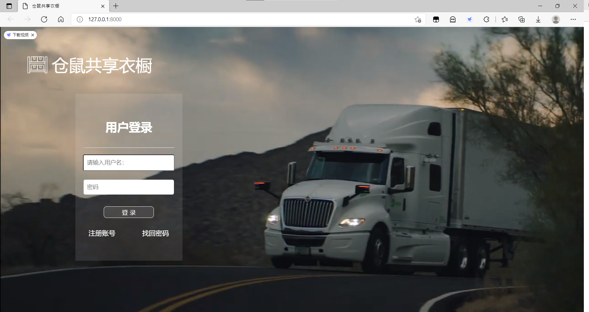

# Shared Wardrobe共享衣橱电商系统

数据库课程设计 SW共享衣橱（Web项目）

## 项目背景

共享衣橱秉承共享理念，增加了衣物销售利用的新的渠道，为环保节约等贡献了巨大的力量。本项目旨在开发一个实用、高效的电子商务系统，用以方便平台将可租赁的衣物展示给用户，同时买家也可以根据自身需求选择自己需要的商品，同时该系统还支持管理员对商品、订单等进行管理操作。本项目力求将各部分模块化、系统化，并极力减少系统的不稳定性以提供给用户以良好的使用体验。

## 环境配置

采用DJango Web框架开发实现，[django官网](https://www.djangoproject.com/)

## 使用方法

### 1 配置python环境

首先确保自己安装了python，建议使用anaconda配置环境

推荐python版本：3.8.3

[Anaconda](https://www.anaconda.com/)

### 2 下载django和simpleui

命令行输入 `conda install django` / `pip install django`

推荐Django版本: 3.2.8

### 3 导入数据库

我们使用的是MySQL数据库，所以需要您先将[.sql](swardrobe.sql)导入到您的数据库中，并在setting.py中链接您的数据库

```python
DATABASES = {
    'default': {
        'ENGINE': 'django.db.backends.mysql',
        'NAME': 'shared_wardrobe',
        'HOST': '127.0.0.1',
        'PORT': '3306',
        'USER': 'root',
        'PASSWORD': '123456'
    }
}
```

### 4 运行

cd 至根目录下 `python manage.py runserver`

在浏览器（推荐使用chrome）中输入`http://127.0.0.1:8000/`

进入管理系统：在url后加`/admin/`

## 部分界面展示
---
登录界面:
<br>


---
商城主页：
<br>


## Django的基本使用方法

对Django的基本使用请见：[Django初见教程](https://www.cnblogs.com/kumori/p/15962582.html)

## 功能模块

- [x] 注册&登录模块
- [x] 完善用户信息
- [x] 浏览商城（主页，详细页等）
- [x] 加入、管理购物车
- [x] 订单
- [x] 后台管理
- [ ] 付款
- [ ] 回收衣物
- [ ] 检索
- [ ] 推荐算法
- [ ] 客服

## Thanks

如果您喜欢这个课设，或者能够帮到您，请点一颗⭐，谢谢！
